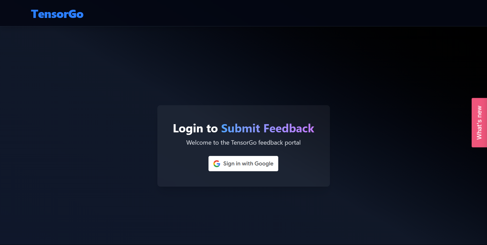
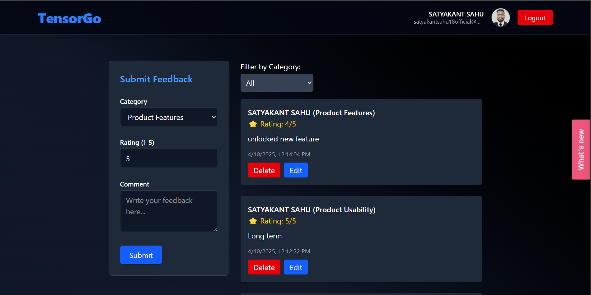
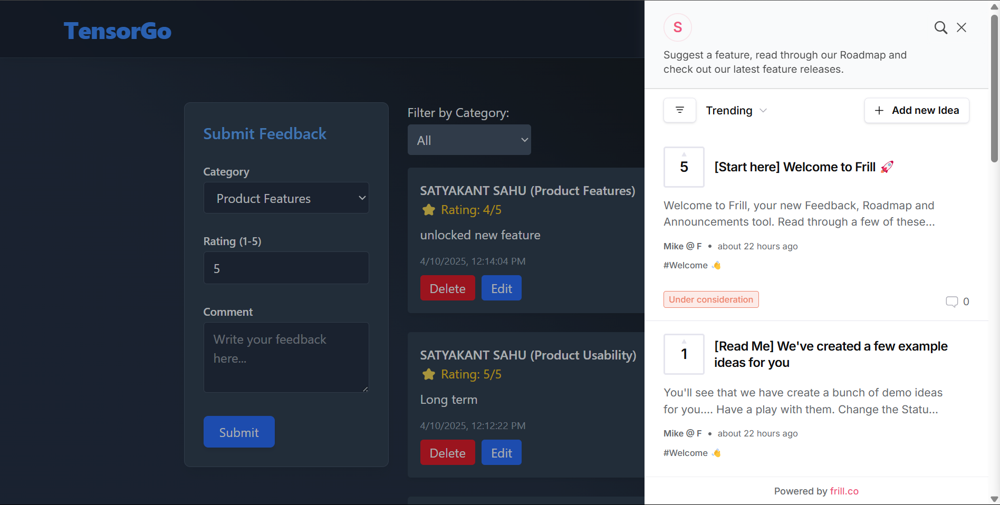

# TensorGo Feedback Portal

A modern feedback platform built with **React**, **Node.js**, **Express**, **TailwindCSS**, **Frill**, **Google OAuth**, and **MongoDB**. Users can log in with their Google account, submit product feedback, and view/filter/edit/delete their submissions in a clean and user-friendly interface.

<br/>

## ✨ Features

- Google OAuth Login (via `@react-oauth/google`)
- Submit feedback with category, rating & comment
- Filter feedback by category
- Edit or delete your own feedback
- Frill Widget Integration (optional)
- MongoDB for storing feedback
- TailwindCSS + Vite + Dark theme design

<br/>

## Screenshots

### 🔑 Login Page



### Feedback Dashboard



<br/>

## Tech Stack

| Frontend     | Backend           | Auth             | Database |
| ------------ | ----------------- | ---------------- | -------- |
| React (Vite) | Node.js (Express) | Google OAuth 2.0 | MongoDB  |
| TailwindCSS  | Axios             | JWT              | Mongoose |

<br/>

# TensorGo Feedback Portal

A feedback system with Google login built using:

- Frontend: React + Tailwind + Vite
- Backend: Node.js + Express + MongoDB
- Auth: Google OAuth2
- Styling: Tailwind CSS

## Setup Instructions

### Frontend

```bash
cd front-end
npm install
npm run dev
```

### Backend

```bash
cd backend
npm install
npm run dev
```

### Environment Variable

#### For Backend

```bash
PORT=5000
GOOGLE_CLIENT_ID=your_google_client_id
JWT_SECRET=your_jwt_secret_key
MONGO_URI=your_mongodb_connection_string
```

#### For Frontend

```bash
VITE_GOOGLE_CLIENT_ID=your_google_client_id
```

### Application Flow

1. **User visits the app** at `http://localhost:5173`.

2. **Google Sign-In** button appears for unauthenticated users.

3. On successful login:

   - User’s Google ID token is sent to the backend (`POST /api/auth/google`).
   - Backend verifies token using Google API, creates JWT, and returns user info.

4. **User session is persisted** using `localStorage`.

5. Authenticated user sees:

   - Feedback form (`category`, `rating`, `comment`)
   - List of all submitted feedback

6. **Feedback submission**:

   - Form data + user info is sent to backend (`POST /api/feedback`).
   - Backend validates and saves it to MongoDB.

7. **Feedback list auto-refreshes** with the latest data.

8. User can:

   - Edit their own feedback (`PUT /api/feedback/:id`)
   - Delete their own feedback (`DELETE /api/feedback/:id`)
   - Filter feedback by category

9. **Logout**:
   - JWT & user info are removed from `localStorage`.
   - User is returned to the login screen.

> This flow ensures only logged-in users can post or manage feedback, and each feedback is associated with the correct user via Google OAuth.

### Frill Feedback Widget

This project integrates the **Frill widget** to collect feature requests and suggestions through an interactive floating button.

#### How It Works

- The widget is added via a script in `index.html`.
- It loads as a floating panel on the bottom-right corner of the app.
- Users can open it to submit feedback directly to our Frill board.

#### Widget Screenshot



> You can manage ideas submitted via Frill on your admin dashboard at [frill.co](https://frill.co).
